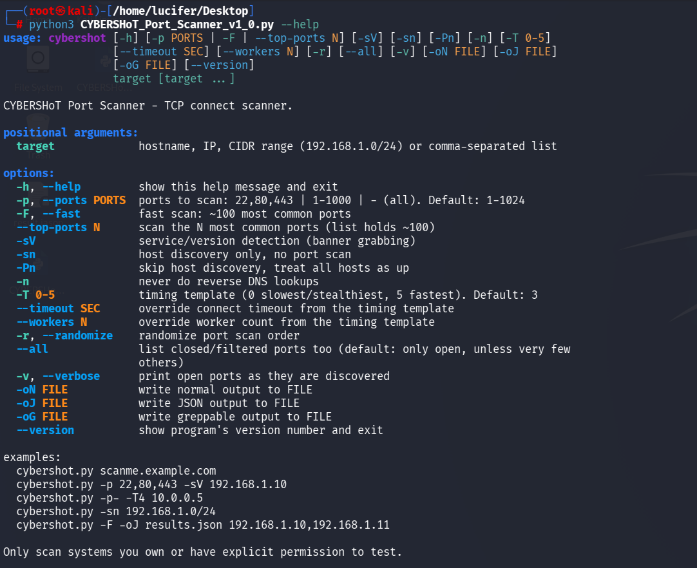
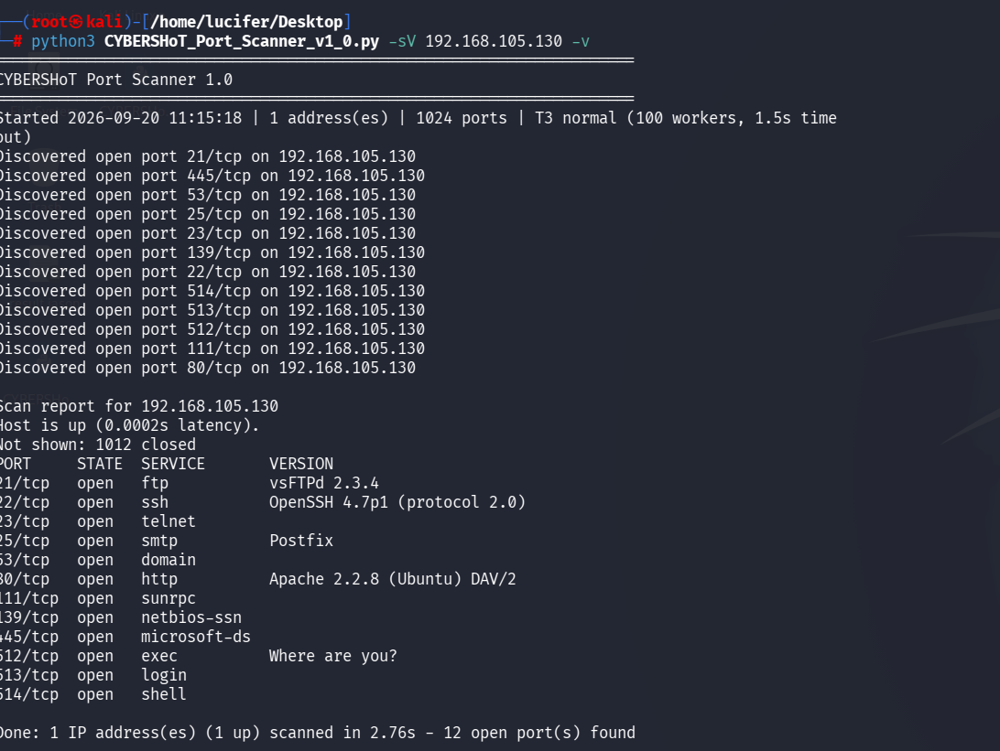
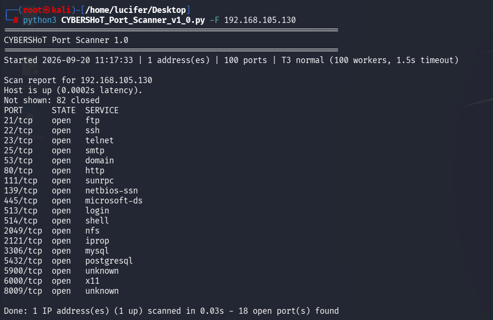

# 🔍 CYBERSHoT_Port_Scanner

A Python-based TCP Connect Port Scanner designed for network reconnaissance, 
host discovery, port scanning, service detection, and structured security analysis.

> ⚠️ For authorized security testing only. Scan only systems you own or have
> explicit permission to test.


## 🚀 Features

- 🔎 TCP Connect port scanning
- 🌐 Hostname and IP address scanning
- 📡 CIDR range scanning
- 🖥️ Host discovery
- 🔧 Service and version detection
- ⚡ Fast scanning of common ports
- 🎯 Custom port selection
- 🔢 Top-N common port scanning
- 🧵 Multithreaded scanning
- ⏱️ Configurable timing templates
- 🔀 Randomized port scanning
- 📊 Normal, JSON, and Greppable output
- 📢 Verbose mode
- 🔄 Connection timeout and retry control

---

## 🛠️ Requirements

- Python 3.x
- Linux / macOS / Windows
- Network access to the target system

Check your Python version:

```bash
python3 --version
````

Windows:

```bash
python --version
```

---

## 📥 Installation

Clone the repository:

```bash
git clone https://github.com/YOUR_USERNAME/CYBERSHoT-Port-Scanner.git
```

Enter the project directory:

```bash
cd CYBERSHoT-Port-Scanner
```

Run the scanner:

```bash
python3 CYBERSHoT_Port_Scanner_v1_0.py --help
```

---

## 💻 Usage

### Basic Scan

```bash
python3 CYBERSHoT_Port_Scanner_v1_0.py 127.0.0.1
```

### Scan Specific Ports

```bash
python3 CYBERSHoT_Port_Scanner_v1_0.py -p 22,80,443 192.168.1.10
```

### Service / Version Detection

```bash
python3 CYBERSHoT_Port_Scanner_v1_0.py -p 22,80,443 -sV 192.168.1.10
```

### Fast Scan

Scan approximately 100 common ports:

```bash
python3 CYBERSHoT_Port_Scanner_v1_0.py -F 192.168.1.10
```

### Scan All Ports

```bash
python3 CYBERSHoT_Port_Scanner_v1_0.py -p- -T4 192.168.1.10
```

### Host Discovery

Discover live hosts without performing a port scan:

```bash
python3 CYBERSHoT_Port_Scanner_v1_0.py -sn 192.168.1.0/24
```

### CIDR Range Scan

```bash
python3 CYBERSHoT_Port_Scanner_v1_0.py 192.168.1.0/24
```

### Multiple Targets

```bash
python3 CYBERSHoT_Port_Scanner_v1_0.py 192.168.1.10,192.168.1.11
```

### Save JSON Results

```bash
python3 CYBERSHoT_Port_Scanner_v1_0.py -F -oJ results.json 192.168.1.10
```

### Randomize Port Order

```bash
python3 CYBERSHoT_Port_Scanner_v1_0.py -r 192.168.1.10
```

### Verbose Mode

```bash
python3 CYBERSHoT_Port_Scanner_v1_0.py -v 192.168.1.10
```

---

## ⚙️ Command-Line Options

| Option            | Description                 |
| ----------------- | --------------------------- |
| `-h, --help`      | Display help                |
| `-p, --ports`     | Specify ports to scan       |
| `-F, --fast`      | Scan common ports           |
| `--top-ports N`   | Scan N common ports         |
| `-sV`             | Service/version detection   |
| `-sn`             | Host discovery only         |
| `-Pn`             | Skip host discovery         |
| `-n`              | Disable reverse DNS lookups |
| `-T 0-5`          | Timing template             |
| `--timeout SEC`   | Set connection timeout      |
| `--workers N`     | Set worker count            |
| `-r, --randomize` | Randomize port order        |
| `--all`           | Show closed/filtered ports  |
| `-v, --verbose`   | Show ports as discovered    |
| `-oN FILE`        | Normal output               |
| `-oJ FILE`        | JSON output                 |
| `-oG FILE`        | Greppable output            |
| `--version`       | Show scanner version        |

---

## 📊 Example Output

Example service/version scan:

```text
CYBERSHoT Port Scanner 1.0

Scan report for 192.168.105.130
Host is up.

PORT     STATE  SERVICE       VERSION
21/tcp   open   ftp           vsFTPd
22/tcp   open   ssh           OpenSSH
23/tcp   open   telnet
25/tcp   open   smtp          Postfix
53/tcp   open   domain
80/tcp   open   http          Apache
111/tcp  open   sunrpc
139/tcp  open   netbios-ssn
445/tcp  open   microsoft-ds
3306/tcp open  mysql
5432/tcp open  postgresql

Done - 12 open port(s) found
```

---

## 📸 Screenshots

### Help Menu


### Service & Version Detection


### Fast Scan


## 🧪 Security Use Cases

CYBERSHoT can be used for authorized:

* Network reconnaissance
* Host discovery
* TCP port enumeration
* Service enumeration
* Banner grabbing
* Security lab exercises
* Vulnerability assessment preparation
* Penetration testing reconnaissance
* CTF and cybersecurity learning environments

---

## 📁 Project Structure

```text
CYBERSHoT-Port-Scanner/
│
├── CYBERSHoT_Port_Scanner_v1_0.py
├── README.md
├── screenshots/
│   ├── help.png
│   ├── service-detection.png
│   └── fast-scan.png
```

---

## 🔐 Legal Disclaimer

CYBERSHoT is intended for educational purposes and authorized security testing.

Do not scan systems, networks, or infrastructure without explicit authorization.

The developer is not responsible for misuse of this tool.

---

## 👨‍💻 Author

**Nikhil Kumar Pankaj**

Cybersecurity | VAPT | Penetration Testing | Python | Linux

---

